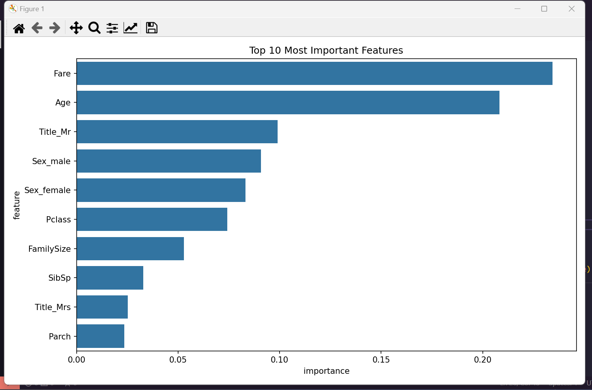

#### Titanic survival prediction

a predictive model in Python that answers the following question: “using data relating to passengers (name, age, gender, socio-economic class, etc.), who has the greatest chance to survive?


The sinking of the Titanic is one of the most infamous shipwrecks in history. On April 15, 1912, during its maiden voyage, the RMS Titanic, widely considered “unsinkable,” sank after hitting an iceberg. Unfortunately, there were not enough lifeboats for everyone on board, resulting in the deaths of 1,502 of the 2,224 passengers and crew.

Although there was an element of luck in survival, it appears that certain groups of people were more likely to survive than others.

https://www.kaggle.com/competitions/titanic




### Requirements

````
pip install -r requirements.txt
````
